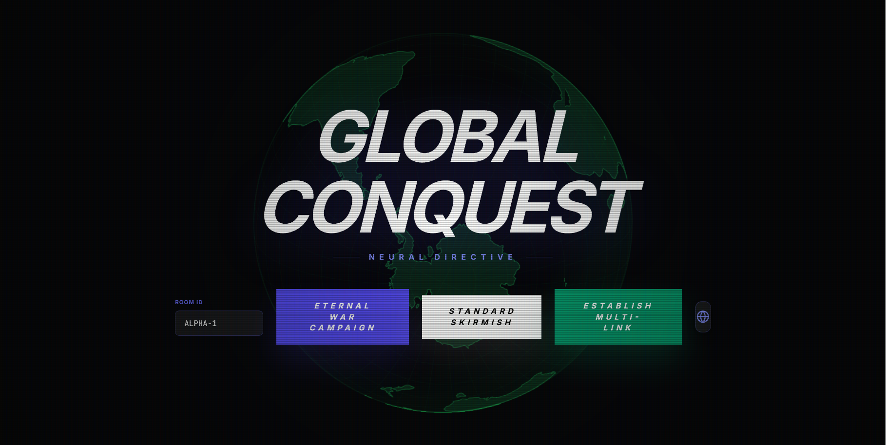
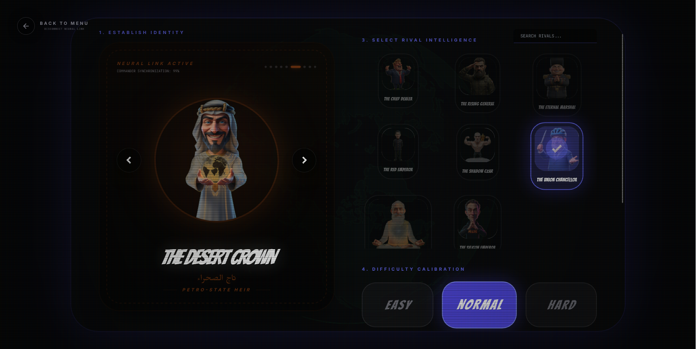
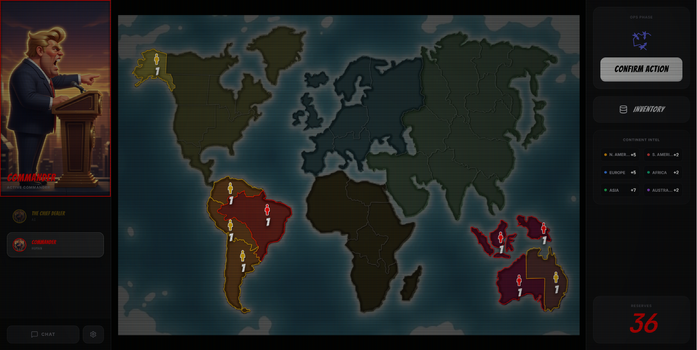
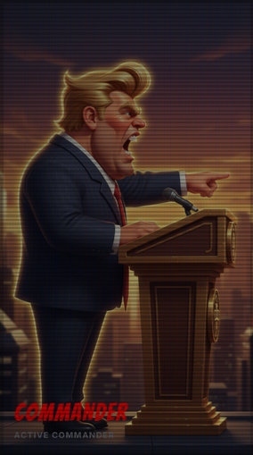

# 🌍 Global Conquest - New World Order 🎖️
> *RiskFlow AI: A turn-based strategy board game of global domination, satirical diplomacy, and tactical warfare.*

[](https://rainbow-peony-f0c791.netlify.app/)
[](https://rainbow-peony-f0c791.netlify.app/)

Welcome to **Global Conquest - New World Order**! In this modern take on the classic board game of *RISK*, you will control armies, claim territories, form global continents, complete secret missions, and face off against nine satirical, fully voiced AI leaders who represent the geopolitical archetypes of today.

---

## 🎮 Play the Game Now!

The application is deployed and ready to play directly in your browser:
### 👉 **[Play Global Conquest - New World Order Online](https://rainbow-peony-f0c791.netlify.app/)** 👈

---

## 📸 Gameplay & Promotional Screenshots

Here is a preview of the high-octane tactical action and modern user interface of the game:

### 1. The Global Command Center (World Map View)
Take a bird's-eye view of all 42 territories across 6 continents. Oversee borders, track troop deployments, and coordinate your path to world domination.


### 2. Annexation and Conquest
Target adjacent enemy territories, assemble your invading armies, and launch your offensive to annex land and claim territory control bonuses.


### 3. Tactical Asset Inventory
Manage your tactical risk cards. Combine Infantry, Cavalry, and Artillery cards to gain massive troop reinforcement boosts during critical deployment phases.


### 4. Dice Combat System
Watch battle outcomes unfold with the customized three-dice attacker / two-dice defender physics engine. Dice are compared highest-to-highest with the defender winning ties.


---

## 🎖️ Meet the Satirical AI Leaders
Face off against 9 colorful, fully voiced geopolitical leaders. Each leader features custom personality prompts, tailored strategic weights, and responsive voiceover lines:

1. **The Chief Dealer (Queens Tycoon):** *"Let’s make this map great again. Nobody conquers like we do. Nobody."*
2. **The Silicon Emperor (Tech Oligarch):** *"Welcome to version 2.0 of global domination. This invasion is open source."*
3. **The Shadow Czar (Eastern Strongman):** *"History is on our side. We do not retreat. We reposition."*
4. **The Red Emperor (Party Chairman):** *"Harmony through strength. The board will align."*
5. **The Desert Crown (Oil Prince):** *"Let us invest in victory. Peace summit tomorrow, airstrikes today."*
6. **The Eternal Marshal (Hermit Supreme):** *"The world fears our glory. Supreme victory is inevitable."*
7. **The Union Chancellor (Continental Bureaucrat):** *"Let us form a coalition. First, a meeting. Sanctions are on the table."*
8. **The Rising General (Frontline Defender):** *"We stand our ground. Every city counts. The world is watching."*
9. **The Subcontinental Strategist (Democratic Giant):** *"A billion voices, one direction. Growth never stops."*

For complete leader voice transcripts and lore, see [docs/character_voice_docs.md](docs/character_voice_docs.md).

---

## 📜 Complete Rule Manual

### 1. Game Setup & Armies
Players choose their colors and start with armies determined by the player count:
* **2 Players:** 40 armies each (plus neutral armies)
* **3 Players:** 35 armies each
* **4 Players:** 30 armies each
* **5 Players:** 25 armies each
* **6 Players:** 20 armies each

All 42 territories on the map are claimed either randomly or in turns. Remaining starting armies are placed strategically on owned territories.

### 2. Continent Reinforcement Bonuses
Control every territory in a continent at the start of your turn to receive a troop bonus:
* **North America** (9 territories): **+5 Armies**
* **South America** (4 territories): **+2 Armies**
* **Europe** (7 territories): **+5 Armies**
* **Africa** (6 territories): **+3 Armies**
* **Asia** (12 territories): **+7 Armies**
* **Australia** (4 territories): **+2 Armies**

### 3. Turn Structure
Each turn consists of three distinct phases:
1. **Reinforcement Phase:** Receive new armies calculated by: `Total Owned Territories / 3` (minimum 3 armies), continent control bonuses, and trading in valid card sets (3 of a kind or 1 of each unit type).
2. **Attack Phase:** Launch attacks from territories with at least 2 armies to any adjacent enemy territory. Roll up to 3 dice against the defender's up to 2 dice.
3. **Fortification Phase:** Make a single tactical transfer of troops from one of your territories to an adjacent connected territory you control, leaving at least 1 army behind.

### 4. Dice Combat Mechanics
Combat outcomes are determined by sorting both attacker's and defender's rolls from highest to lowest:
* Compare the highest pair: Highest roll wins; **defender wins ties**.
* Compare the second highest pair (if both rolled multiple dice): Highest roll wins; defender wins ties.
* Defeated armies are removed immediately.

For a full list of rules, see [docs/prime_directive.md](docs/prime_directive.md).

---

## 🔑 Secret Missions & Special Mechanics

### 🕵️ Secret Mission Cards
Instead of total world domination, opt for **Secret Mission Cards** to win the game instantly upon completion:
* **Continent Conquest:** Control specified continent combinations (e.g., Europe, Australia, and one other).
* **Player Elimination:** Seek and destroy a specific colored opponent. If they are not in the game or are eliminated by someone else, your mission pivots to claiming 24 territories of your choice.
* **Global Control:** Control 24 territories of your choice.

Review all mission cards at [docs/missionCards.md](docs/missionCards.md).

### ⚔️ Army Units & Artillery
Tactical cards feature unit symbols representing army increments:
* **Infantry:** 1 unit
* **Cavalry:** 5 units
* **Artillery:** 10 units

Combine three of a kind or one of each to trigger escalating card-trade reinforcements:
* 1st Set: **+4 Armies** | 2nd Set: **+6 Armies** | 3rd Set: **+8 Armies** | 4th Set: **+10 Armies** | 5th Set: **+12 Armies** (each set after yields an additional `+5 Armies`).
* If you own the territory pictured on a traded card, you receive **+2 extra armies** on that territory!

See [docs/artillery.md](docs/artillery.md) and [docs/cardList.md](docs/cardList.md) for more.

---

## 🛠️ Run Locally

### Prerequisites
* **Node.js** (v18+ recommended)
* **npm** or **Yarn**

### Installation Steps
1. Clone the repository and navigate to the project directory.
2. Install the package dependencies:
   ```bash
   npm install
   ```
3. Copy the environment template file and insert your Gemini API Key:
   Create a `.env.local` or `.env` file at the root:
   ```env
   GEMINI_API_KEY="your-gemini-api-key-here"
   ```
4. Spin up the development server:
   ```bash
   npm run dev
   ```
5. Open your browser and navigate to `http://localhost:5173` to play!

### Build and Deployment
To compile the production build:
```bash
npm run build
```
The output assets will be generated in the `dist/` directory, ready to serve or deploy to Netlify/GitHub Pages.

---

## 📂 Documentation Directory Reorganization
To keep the project clean and modular, loose non-code asset files have been organized under the `docs/` folder:
* Rules & Directives: [docs/prime_directive.md](docs/prime_directive.md)
* Secret Missions: [docs/missionCards.md](docs/missionCards.md)
* Satirical AI Leaders Lore: [docs/npc_characters.md](docs/npc_characters.md) / [docs/character_voice_docs.md](docs/character_voice_docs.md)
* Tactical Card Inventory: [docs/cardList.md](docs/cardList.md)
* Artillery & Dice Specifications: [docs/artillery.md](docs/artillery.md) / [docs/diceFace.md](docs/diceFace.md)
* Rule Book PDF: [docs/risk.pdf](docs/risk.pdf)
* System error logs & specifications: [docs/errors.md](docs/errors.md)
* Gameplay Screenshots: [docs/promo/](docs/promo/)

---

*Command your armies, deploy your tactical reinforcements, and claim the World Order!* 🌍⚔️
